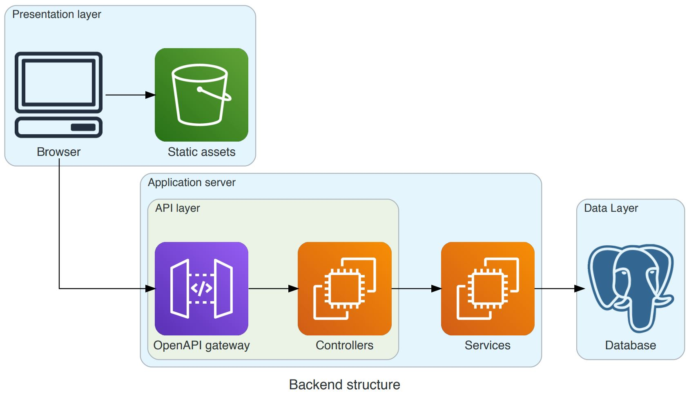
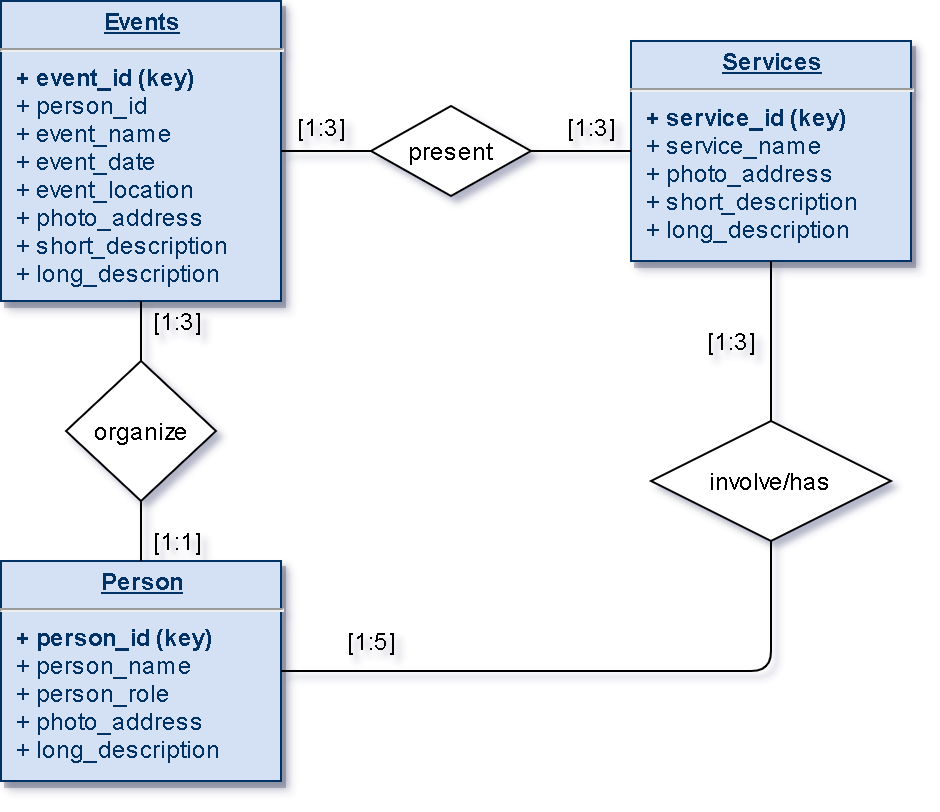
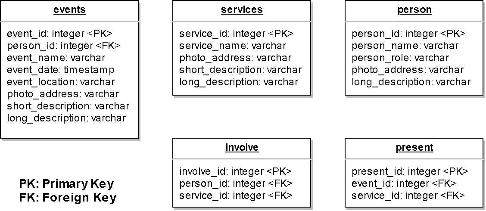
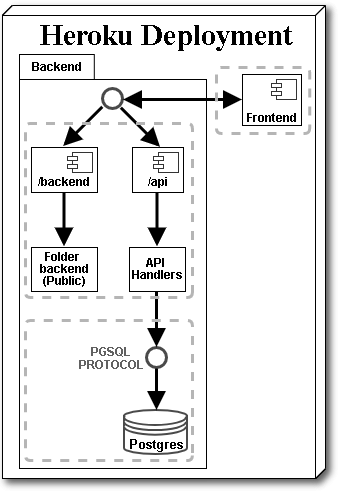

# Backend Documentation

## General group information

**Course:** Hypermedia Applications (Web and Multimedia)

**Group Name:** SophisticatedKids

| Member    | Role              | First name    | Last Name   | Person Code | Email address |
| --        |--                 |--             | --          | --          | --            |
| 1         | Administrator     | Mohammad      | Ala Amjadi  | -           | -             |
| 2         | Anonymous Member  | -             | -           | -           | -             |


## Links to other deliverables

- Deliverable D0: The web application is accessible atmak [this address](../ ":ignore title").
- Deliverable D2: the YAML or JSON file containing the specification of the app API can be found at [this address](spec.yaml ":ignore title").
- Deliverable D3: the SwaggerUI page of the same API is available at [this address](swaggerui ":ignore title").
- Deliverable D4: the source code of D0 is available as a zip file at [this address](app.zip ":ignore title").
- Deliverable D5: the address of the online source control repository is available [this address](https://github.com/alaamjadi/HSK). We hereby declare that this is a private repository and, upon request, we will give access to the instructors.


## Specification

#### Web Architecture


Our web application's architecture is built on three layers:
<ul>
<li>Data layer</li>
<li>Application</li>
<li>Presentation</li>
</ul>

The data layer is implemented through the <code>PostgreSQL</code> database, which contains the application data.

The application layer is implemented through the backend software which exposes a REST API (under the endpoint <code>/api</code>) to the public in order to enable the interaction with frontend using a <code>Node.js</code> server. This layer contains three compnents, openAPI gateway, controllers, and services. The openAPI gateway and controllers together become as API layer which connects to the data layer using services and makes the application layer to become an interface between data later and presentation layer. The services interacts with the data layer to retrieve the data from database using a SQL query builder for Postgress named <code>knex</code> provided by node package manager (npm).

The presentation layer is implemented through the frontend component. This component contains the logic to load asynchronously data as <code>JSON</code> objects from the application layaer with a REST API and render the web pages on client side from presenetation layer using <code>HTML</code>/<code>CSS</code>/<code>JavaScript</code>. For the frontend part <code>Bootstrap 4</code> framework has been used to satisfy responsiveness.





### API

#### REST compliance
We'll approached REST principles by targeting their main points, by explaining if and why we have followed those principles.
- Uniform Interface: this is fundamental to the REST Api design and we did our best to follow this principle. Our interface is resource based, the client has enough information to customize the sources where he has the permissions just from their representation, the messages are self descriptive,and we use HATEOAS (Hypermedia as the Engine of Application State).
- Client-Server: the client application and server application are totally able to evolve separately without any dependency on each other.
- Stateless: we obviously could make our application stateless, as session management was not requested.
- Layered System: the system is layered, as the server is deployed in a place other than the one where the postgres server is.
- Code on demand: we are actually always sending the static representations of our resources in the form of JSON, so this point is not relevant.

The required HTTP status codes were introduced in the REST API. We used an [OpenAPI Specification](https://swagger.io/docs/specification/about/) (formerly Swagger Specification) in order to build an API description. We chose to have three main resource models that comply with the REST principles. Each resource has a unique identifier and can be retrieved explicitly using a "GET" command with the URI of the resource. A group of all resources can also be retrieved if the ID is not specified. We also used nested paths in order to retrieve related resources of a specific resource. For example, in the nested path <code>/api/events/eventId/person</code>, we retrieved the list of persons who are a contact for an event with a specific eventId.

#### OpenAPI Resource models

We kept everything simple, in order to have a more understendable model: the most part of our resourcesare were described by a key-value. Event dates and urls are saved throught strings. Most of the tables in the database store a unique identifier for every row, such as the Event/Service/Person ID.

The Resources are introduced in the following models which are related to the data models.
  - <code>Events</code>
  - <code>Person</code>
  - <code>Services</code>

For each resource we have the following standard GET methods
<ul>
<li><code>/api/{resource}/</code></li>
<li><code>/api/{resource}/{resourceId}</code></li>
<li><code>/api/{resource}/{resourceId}/connection1</code></li>
<li><code>/api/{resource}/{resourceId}/connection2</code></li>
</ul>

To handle the events filteration more efficiently we have introduced the following endpoint to retrieve event data by specifying their year and month.
<ul>
<li><code>/api/Events/Y/{Year}/M/{Month}</code></li>
</ul>

A group of all resources can also be retrieved if the ID is not specified. This can happen by using the <code>/api/{resource}/</code> endpoint which returns an array of objects.

Each resource has a unique identifier which can be used with <code>/api/{resource}/{resourceId}</code> endpoint to retrieve an explicit single resource item.

The <code>connection1</code> and <code>connection2</code> are the related resources that have a connection to the main resource which we use them to retrieve a subdata of their resources. For example <code>/api/Events/{eventId}/Services</code> and <code>/api/Events/{eventId}/Person</code> return an array of objects which are the related services and persons for a specific event. Another example could be <code>/api/Services/{serviceId}/Events</code> and <code>/api/Services/{serviceId}/Person</code> return an array of objects which are the related events and persons for a specific service.

### Data model

In our OpenAPI data model we have:
  - Events
  - Person
  - Services

Here is the ER diagram of the model:



The data layer and OpenAPI data model mapping is as follows:

  | OpenAPI Model           | Data Layer    |
  | ------------------------| --------------|
  | Events                  | Events        |
  | Person                  | Person        |
  | Services                | Services      |
  | No mapping (\*)         | Involve       |
  | No mapping (\*)         | Present       |

\*: There were no direct mapping for <code>Involve</code> and <code>Present</code> tables since we created them by joining <code>Person</code> and <code>Services</code> tables together to get the <code>Involve</code> table and also we joined <code>Events</code> and <code>Services</code> tables to get the <code>Present</code> table.




## Implementation

### Tools used

The languages and frameworks that were used:

- <code>HTML</code> / <code>CSS</code> / <code>JavaScript</code>
- <code>JSON</code> / <code>YAML</code>
- <code>SQL</code>
- <code>Bootstrap</code> framework for frontend
- <code>Connect.js</code> framework for backend

The technology stack and tools that were used:
 - <code>Javascript</code> on <code>Node.js</code> runtime using <code>npm</code> as the default package manager.
 - <code>Swagger</code> (OpenAPI) using <code>Swagger Editor</code> ([link](https://editor.swagger.io/)) to generate and manage the server and the specification.
 - <code>Postman</code> for testing the API completly but we could also use [Swagger inspector](https://inspector.swagger.io/).
 - <code>Postgres</code> RDBMS and <code>pg Admin 4</code> query tool
 - <code>Fetch API</code> to retrieve data from API
 - <code>Visual Studio Code</code> as a text editor embedded with linter to analyzes source code in order to flag programming errors, bugs, stylistic errors, and suspicious constructs.
 - <code>Git Bash</code> to reduce the confusion while using git repository by having colorful texts in CLI.
 - <code>Developer tools</code> embedded in Google chrome.

The node packages that were used:
  - <code>js-yaml</code> is an implementation of YAML, a human-friendly data serialization language.
  - <code>swagger-tools</code> provides various tools for integrating and interacting with Swagger.
  - <code>serve-static</code> creates a new middleware function to serve files from within a given root directory. The file to serve will be determined by combining req.url with the provided root directory.
  - <code>connect</code> is an extensible HTTP server framework for node using "plugins" known as middleware.
  - <code>connect-redirection</code> is a middleware which adds a redirect function to the response.
  - <code>pg</code> node-postgres (aka pg) is a collection of Node.js modules for interfacing with PostgreSQL database.
  - <code>knex.js</code> is a SQL query builder for Postgres designed to be flexible, portable, and easy to use.

### Environments

We used localhost testing environment for development. The environment composed by Node.js, Postgres and PGAdmin.

The production environment is hosted on Heroku. They provide a ready to use Postgres database and a NodeJS environment.





### Project structure

```
.
└── api
    └── swagger.yaml      # openAPI specification
└── controllers           # API controllers
└── other/                # database initilization and data
└── public                # static files served to the browser
    ├── assets/           # all website assets css/img/js
    ├── backend/          # all project delivery materials
    ├── pages/            # static pages of website
    └── index.html        # main starting page (home-page)
├── app.json              # manifest format
├── index.js              # app startup for node server
├── package.json          # npm project dependencies
└── README.md             # git documentation
```

### Discussion

<blockquote>How did you make sure your web application adheres to the provided OpenAPI specification? Which method did you use to test all APIs endpoints against the expected response?</blockquote>

We started from the OpenAPI specification to build the project, and during the process of building the web application, we changed and manipulated the specification in order to keep it updated and coherent with the state of our project. Almost every API operation is used from the front end side, and if not, either the operation can be used to add data to the database (We did not implement since it was not neccessary) or to supply data to other operations. Moreover, we did not have an extra endpoints that were not used, however the parent edpoints or combinations of endpoints can be used in the front-end to expand the application anytime.

For testing all APIs endpoints against expected response, we used <code>Postman</code>. We could also use [Swagger inspector](https://inspector.swagger.io/).


<blockquote>Why do you think your web application adheres to common practices to partition the web application (static assets vs. application data)</blockquote>

The application strictly separate the frontend (HTML/CSS/JS) from the backend components (Data in remote DB) and they communicate only through the REST API using HTTP requests via <code>/api/{resource}</code> paths. The source of backend is placed in the project root <code>/</code>, while the source of frontend is placed under <code>/public</code> directory and is addressed with *serve-static* in the web application. However, as it was not required for all the pages to be dynamic there are some pages such as Home/Association/Contact that use static data.


<blockquote>Describe synthetically why and how did you manage session state, what are the state change triggering actions (e.g., POST to login etc..).</blockquote>

We skipped this part since we did not need to handle sessions and it was not required and neccessary for our application.


<blockquote>Which technology did you use (relational or a no-SQL database) for managing the data model?</blockquote>

We used a relation database called PostgreSQL. The relation model fits good in a project were you have to manage various associations between different models. 


## Other information

### Task assignment

| Member                | Front-end | OpenAPI | Backend |
| --                    |--         |--       | --      |
| Mohammad  Ala Amjadi  | 70%       | 100%    | 100%    |
| Anonymous Member      | 30%       | 0%      | 0%      |

### Analysis of existing API
For our project we used the following OpenAPI:

- The example showed in class of [dataatwork.org](http://dataatwork.org/).
- The simple and basic example by swagger.io of a [Pet Store](https://petstore.swagger.io/).
- As advised in class we found these two OpenAPIs on [APIs Guru](https://apis.guru/browse-apis/): [Personalizer Client API](https://api.apis.guru/v2/specs/azure.com/cognitiveservices-Personalizer/v1.0/swagger.yaml) and [Listen API: Podcast Search & Directory](https://api.apis.guru/v2/specs/listennotes.com/2.0/openapi.yaml).
- There is also an other more extended and detailed API that is the [Google Books API](https://api.apis.guru/v2/specs/googleapis.com/books/v1/openapi.yaml).

By looking at those examples we got a better idea about OpenAPI. We constantly looked at the [OpenAPI Specification](https://swagger.io/docs/specification/about/) documentation during the development phase. We started with presenting our first version of swagger. Each time that we had a tutroing sessions we got a feedback which we took into account. 
When we tried to develope the swagger services we realized that we have to change a lot. So we generated many swagger versions. In the end we reached the event page, in order to handle some features (Event filteration) there we were forced to change the swagger again and we have decided to have an extra endpoint for events to retrieve event data by specifying their year and month for the events page, in case the events were scaling up in our website. At the end, by testing the API over and over and going forward with the developement we were sure that our final specification became a fit to our application.

### Learning outcome
In this project anonymous member and Mohammad both have learned how to create an OpenAPI Specification and how to implement it using a Node.js server.
- Anonymous member improved her HTML, CSS and SQL skills while she learned more JavaScript specially using Fetch API and Promisses.
- Mohammad improved his JavaScript skills while he learned about DOM, Bootstrap and SQL from scratch. Mohamamd has plan to develope and implement simillar projects in the future.

Some unanswered questions are:
- In our project we have inserted into the db a small number of data. How scalability and performance go with bigger data? Are there other methods to implement a more performant version?
- We used Heroku to provide our application. How can we migrate to another PasS (Platform as a Service) for example GCP (Google Cloud Platform.) What measurements we have to take into account to choose the best platform solution?
- How should we handle the security part of ou application? Should we change our source code or there are other ways to handle the security more smoothly?
- Are there any better technology solutions beside the one we had used?
